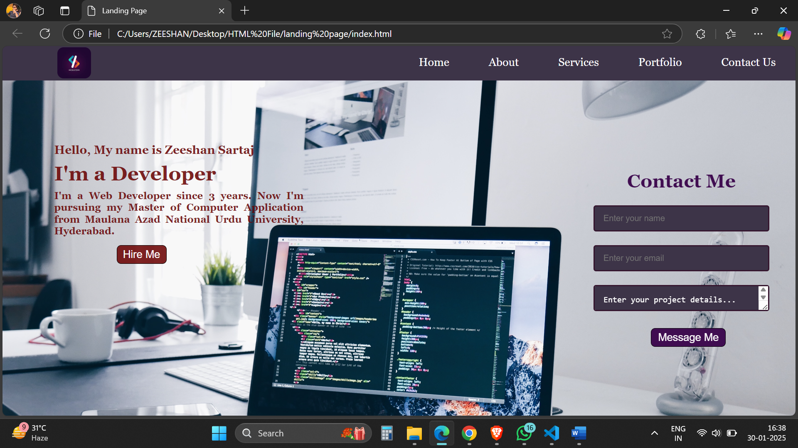

# Landing Page

## Overview

This is a simple landing page built using **HTML** and **CSS**. It features a navigation bar, an introduction section, and a contact form.

## Features

- **Responsive Navigation Bar** with links to different sections.
- **Introduction Section** with a welcome message and a call-to-action button.
- **Contact Form** with fields for name, email, and project details.

## Technologies Used

- **HTML5** for structuring the webpage.
- **CSS3** for styling the webpage.

Screenshots

## How to Run

1. Download or clone this repository.
2. Open the `index.html` file in any web browser.

## Contact

For any inquiries, feel free to reach out:

- Email: [zeeshansartaj.cs@gmail.com]

